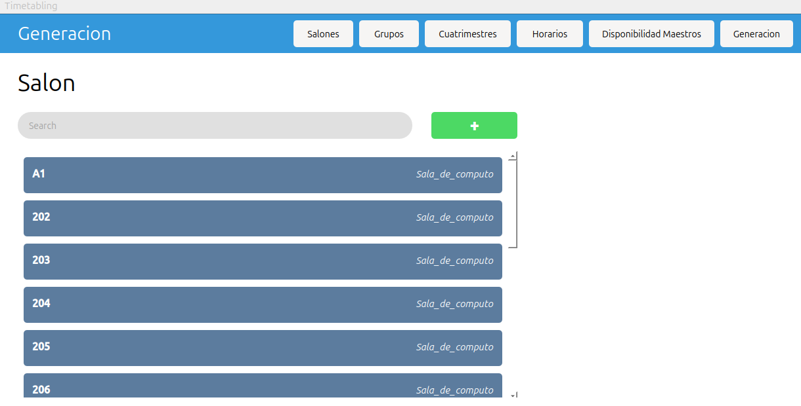
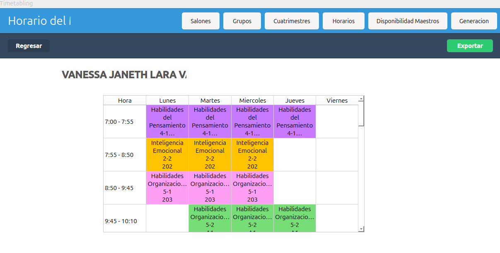

Sistema de resolución de Universal Timetabling (situacion escolar/universitaria):

Sistema enfocado en resolver el universal timetabling para universidades, donde los elemento en los que se basan son los grupos,salones y maestros que conforman la escuela, el sistema es capaz de generar una representación visual de todos los valores necesarios para el sistema:

Actividades dentro del sistema:
-Guardado en csv
-Carga de datos desde csv propios
-No necesita internet
-Genera objetos en base a los csv
-visualización y administración de componentes fuera de terminal
-generación de soluciones de universal Timetabling
-Visualización de resultados fuera de terminal
-guardado individual de horarios de diferentes maestros,grupos y salones en archivos csv

Administración del sistema qt

Paginas hechas en qt para el manejo de datos. cada acción esta de raiz de la carga de datos del sistema.
